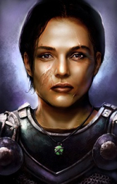

<html>

<b>Corwin</b>

<b>Mod for EET and
BGEE/SoD</b>

Captain Corwin of
the Flaming Fist in the town of Baldur's Gate is an original SoD NPC. 
Her story ends with the protagonist having to leave for Amn. This mod does not
change this - instead I made the new approach to extend the NPC's story
forward, which in her special case seems to make much more sense. Her loyalty
is with her town, its people, and the Flaming Fist and she will not leave it. 
The mod makes Corwin available as a joinable NPC as soon as you get access to
the city in the BG1 part of the game. Scar introduces her on your first meeting
with him and you can chose her to help you with the affairs that trouble her
hometown. 
 
Features: 
- A joinable NPC for the second half of BG1 
- Interactions with the protagonist to flesh out the initial friendship (or
not) that seques into the possible SoD romance. 
- additional encounters and scenes that add to Corwin's background story. 
- insights into the Flaming Fist relation to the Iron Throne and Sarevok,
contents referring to Scar, Angelo, Eltan, Alatos, Skie and others. 
- A continuous Corwin: She will follow you into SoD initial dungeon. During the
city overture of SoD she will keep her original role to accompany you without
joining, however her dialogues and reaction will reflect the case that she
knows you already and has travelled with you. She becomes joinable (again) as
soon as you leave the city and she will continue as the same incarnation you
had in BG1. 
- The original SoD content (including the romance) is preserved but adjusted to
the possibility of her being already acquainted with the protagonist prior to
the crusade. All in all the pre-SoD content is intended to give Corwin a deeper
personality and make her SoD actions and decisions more transparent. 
- Not to forget that Corwin is a useful archer in BG1 and keeps her stat gains,
XP, equipment etc when she joins you again in SoD. 
 
&nbsp;

&nbsp;

</body>

</html>
